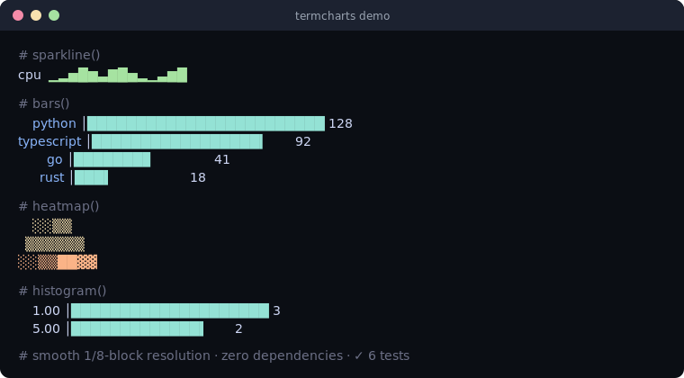

# termcharts

[](https://github.com/JCreatesGH/term-charts/actions)
[](https://www.python.org/)
[](LICENSE)

Tiny, **zero-dependency** Unicode charts for the terminal — sparklines, bar charts, histograms, and heatmaps as plain strings. Perfect for CLIs, dashboards, log output, and status scripts.



## Install

```bash
pip install termcharts
```

## Use it

```python
from termcharts import sparkline, bars, columns, histogram, heatmap

sparkline([3, 4, 6, 9, 7, 5, 8, 9, 6])      # "▁▂▅█▆▃▇█▅"
sparkline(week, lo=0, hi=100)               # pin the scale to compare sparklines

print(bars({"python": 128, "typescript": 92, "go": 41}, width=24))
#     python │████████████████████████ 128
# typescript │█████████████████▎       92
#         go │███████▊                 41

print(columns([2, 5, 8, 6, 9, 4], height=4))   # vertical bar chart, top row first

print(histogram(samples, bins=10))
print(heatmap([[0, 1, 2], [1, 3, 5], [2, 4, 8]]))
```

## Why it's nice

- **Smooth bars** — horizontal `bars`/`hbar` use 1/8th-width blocks and vertical `columns` use 1/8th-height blocks, so fractional values render crisper than whole-block charts.
- **Just strings** — every function returns a `str`, so you can log it, put it in a table, or embed it in a Slack message. No terminal control codes, no dependencies.
- **Auto-scaled, or pinned** — sparklines/heatmaps normalize to their own min/max, and `sparkline(values, lo, hi)` lets you fix the axis to compare series.

## API

`sparkline(values, lo=None, hi=None)` · `bars(dict_or_pairs, width=20)` · `hbar(value, max, width=20)` · `columns(values, height=8)` · `histogram(values, bins=10)` · `heatmap(2d_grid)`

## Development

```bash
pip install -e .[dev] && python -m pytest -q   # 8 tests
```

## License

MIT
